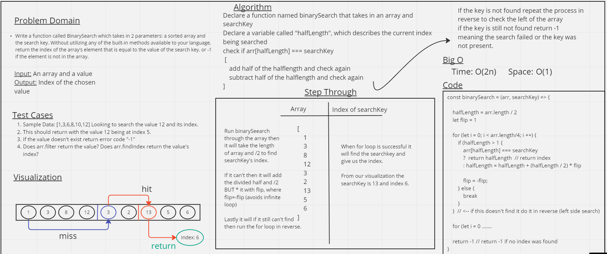

# Challenge Title

Write a function called arrayBinarySearch which takes in an array and a searchKey to find. Without utilizing any of the built-in methods available to your language, return the index of the searchKey - we are assuming that the array is not sorted due to the format of the inputs given

[Pull Request 22](https://github.com/ShadowDraco/data-structures-and-algorithms/pull/22)

## Whiteboard Process

## Approach & Efficiency

We decided to use a function with two for loops for our brainstorm of this search pattern. A visualization of binary search points to the center of the array, and then takes half steps left and right in the array until it finds the value. However these half steps do not check the front half of the array, nor do they search the ends. We decided that running two for loops with a set length would be the best way to attempt searching both sides of the array and breaking up the halves. Theoretically the search can run with BigO(n) but it can also come up with a time of O(2n) and still manage to not find the searchKey. With more time or some practice we'd have a better solution.

## Collaborators

- I wrote this whiteboard with Tim Maupin

## Solution

<!-- Show how to run your code, and examples of it in action -->

To run the code simply call the array-binary-search function in the terminal
with an array containing two or more values and a searchKey. It will return the index of the found searchKey inside the given array, or -1 if it remains unfound.

For example: `array-binary-search([5, 4, 6, 7, 8], 6)` will return `2`
