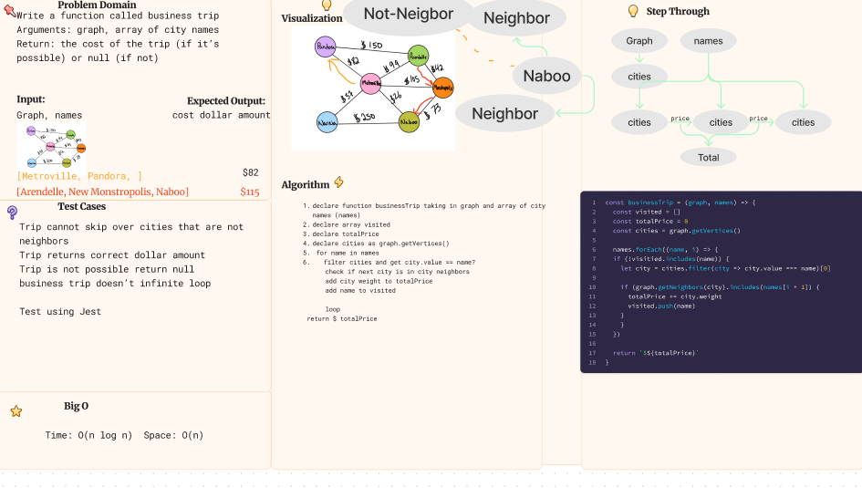

# Business Trip

Given a business trip itinerary, and an Alaska Airlines route map, is the trip possible with direct flights? If so, how much will the total trip cost be?

## Approach & Efficiency

- Write a function called business trip
  Arguments: graph, array of city names
  Return: the cost of the trip (if it’s possible) or null (if not) Determine whether the trip is possible with direct flights, and how much it would cost.

## Whiteboard process

- 

### for storing data that is efficient and effectively stored

### Tests

- Can return single city trip
- Can return multiple city trip
- returns null when city is not a neighbor

## Solution

- run `npm test businessTrip` to test all businessTrip things
- To run and test the code simply instantiate a new graph `const graph = new Graph()` currently you add values to the graph manually
