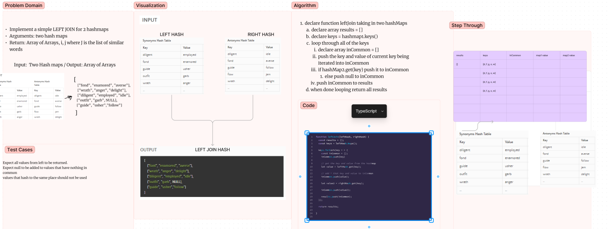

# Code Challenge 33

## Tree Intersection

Write a function called left join
Arguments: two hash maps
Return: Array of arrays, each row in the matrix is the values of each key in the first hash map left joined with the value of the same key in the second hashmap

### How to use it

The function can be run by calling `leftJoin` with two hashmaps that both have a key value pair defined. If there are no values in common return is all values of the first hashmap left joined with a `NULL`.

### What it does

The function keys the keys of a hashmap and loops through them, comapring that value at hashmap1[key] and hashmap2[key] if there is a match it joins the key value pair from hashmap1, and the value from hashmap2 into an array and pushes it into a matrix. This is done for all keys in the first array only, therefore all values that the second hash map has that do not match will remain unused.The time and space remain near O(N)/O(1) because there is no need to loop through the values multiple times with this implementation.

### Tests

All tests associated with this function are available with `npm test leftJoin`

#### Whiteboard process

