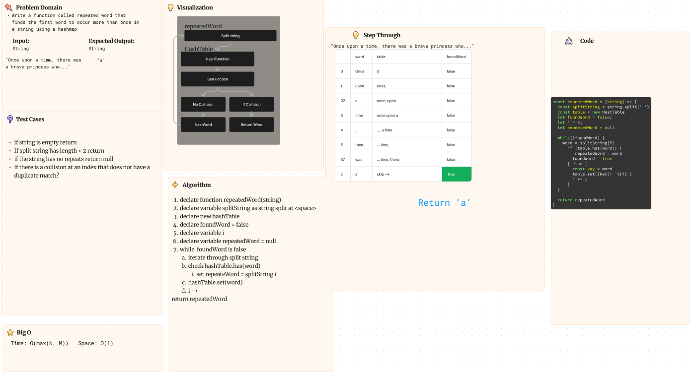

# Code Challenge 32

## Repeated Word

Write a function called repeated word that finds the first word to occur more than once in a string
Arguments: string
Return: string

### How to use it

The function can be run by calling `repeatedWord` with any string value with 2 or more words separated by spaces. It automatically splits the string of words by spaces and checks for duplicate words by storing them into a hash table. When a collision occurs the algorithm assumes that a duplicate is found.

### Tests

All tests associated with this function are available with `npm test repeatedWord`

#### Whiteboard process

