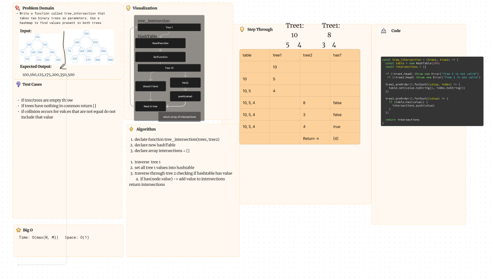

# Code Challenge 32

## Tree Intersection

Write a function called tree_intersection that takes two **binary trees** as parameters.
Using a Hashmap return a set of values found in both trees.

### How to use it

The function can be run by calling `tree_intersection` with two trees that both have a head defined. An error will throw saying which tree is invalid (if applicable). If there are no values in common return is an empty array.

### What it does

The function creates a hash map to compare the values of the trees, setting all values from the first into the hash map and comparing using the `has(key)` function for the second. The time and space remain O(N)/O(1) because there is no need to loop through the values a third time with this implementation.

### Tests

All tests associated with this function are available with `npm test tree-intersection`

#### Whiteboard process

