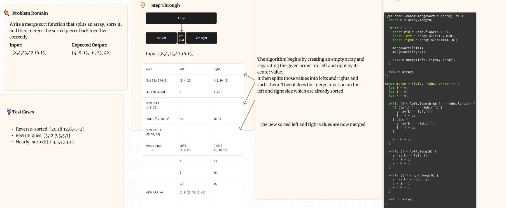

# Challenge Title

Write a function called merge sort that uses array methods to sort a given array least to greatest.

## Whiteboard Process

## Approach & Efficiency

The algorithm begins by creating an empty array and
separating the given array into left and right by its center value.
It then splits those values into lefts and rights and sorts them. Then it does the merge function on the left and right side which are already sorted. The new sorted left and right values are now merged.

## Solution

<!-- Show how to run your code, and examples of it in action -->

To run the code simply call the mergenSort function in the file, passing in an array with two or more values. Or include the function in another file to test your own uses. Run `npm test merge-sort` to run the built in tests

For example: mergeSort([5, 4, 6, 7, 8]) will return [4, 5, 6, 7, 8]
