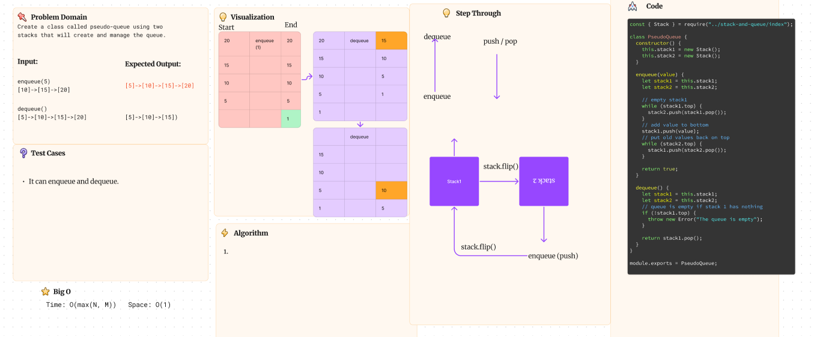

# Challenge Title

Create a class called pseudoQueue that implements two stacks to create the functionality of a Queue.

## Whiteboard Process

## Approach & Efficiency

Using 2 stacks we empty one stack into another to enqueue at the bottom of the first. Then empty the second stack back into the first to leave the added value at the bottom.

## Solution

<!-- Show how to run your code, and examples of it in action -->

To run the code simply type `npm test pseudo-queue` or create a `new PseudoQueue()` and `enqueue(1)/dequeue()` to make your own
