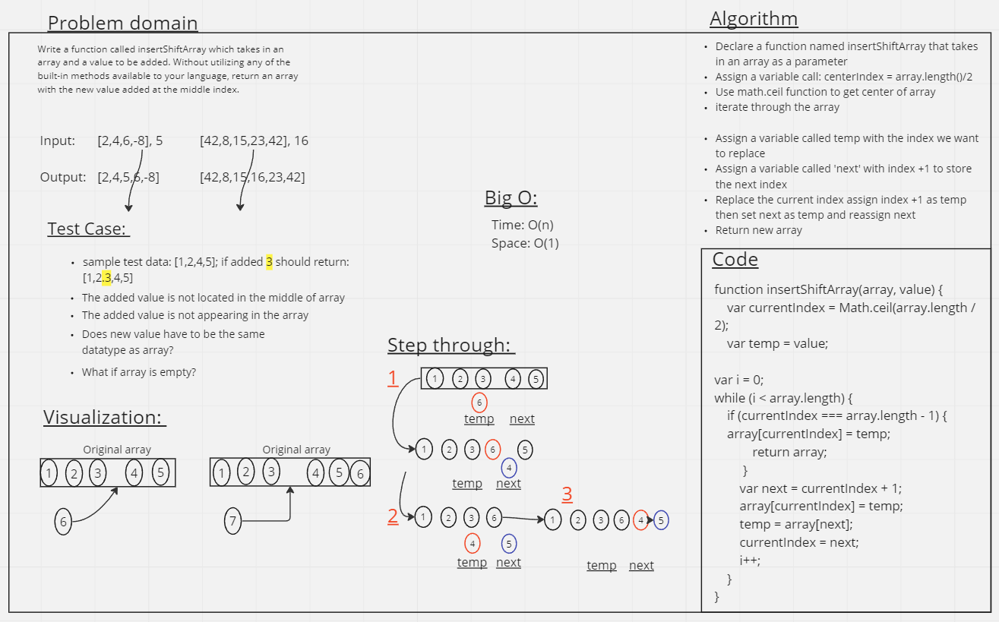

# Challenge Title

Write a function called insertShiftArray which takes in an array and a value to be added. Without utilizing any of the built-in methods available to your language, return an array with the new value added at the middle index.

## Whiteboard Process

## Approach & Efficiency

We decided to use a while loop to solve this problem due to the unnecessary complexity that a for loop may bring. Starting with an index in the middle of the array we placed a temporary variable to store the value we're about to use, and a next variable to store the value we want to keep safe. Then we iterated through the array and shifted every value after the middle point using this method until we reached the end.

## Collaborators

- I wrote this whiteboard with Kao Saelor

## Solution

<!-- Show how to run your code, and examples of it in action -->

To run the code simply call the arrayShiftArray function in the terminal
with an array containing two or more values and a value to insert. It will return the array with the new value inserted into the center. If the array is uneven it will insert the new value to the right, at a higher index.

For example: `insertShiftArray([5, 4, 6, 7, 8], 10)` will return `[8, 7, 6, 10 4, 5]`
