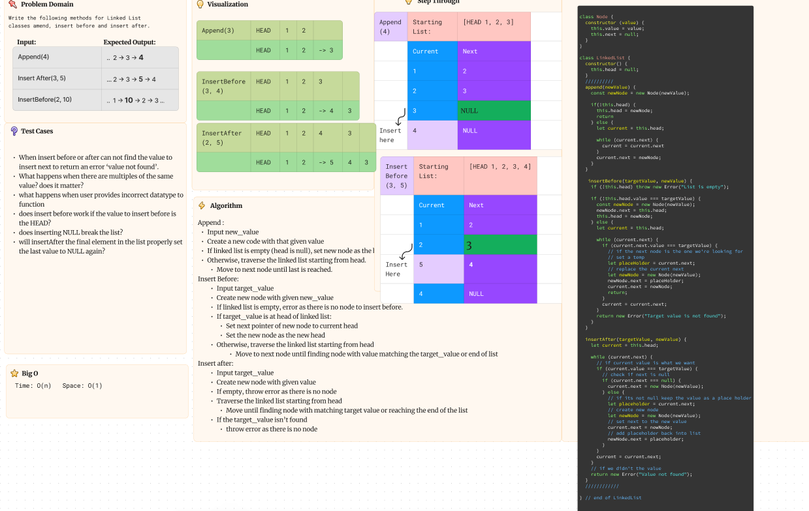
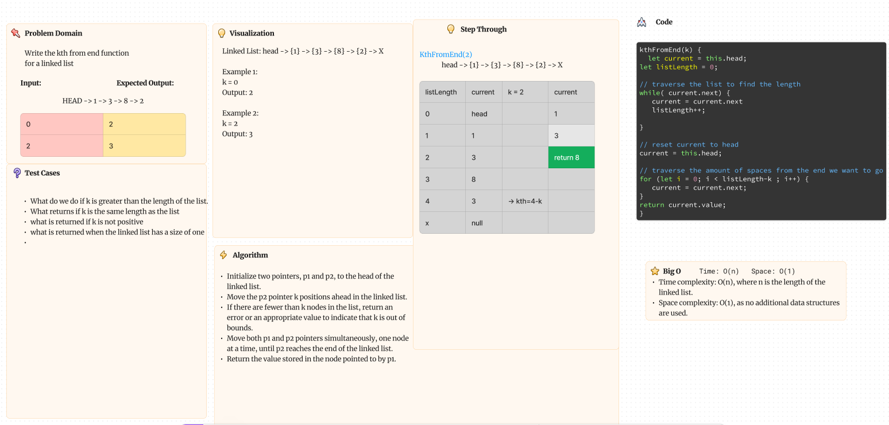

# Linked List

Build your own linked list class for future use!

## Approach & Efficiency

- We approached the new functions by visualizing and stepping through them before writing the code. Then after we finished out whiteboard tested the code in an ide and putting both eyes on it to fix any errors we could have made.

## Whiteboard process

- With Coriana Williams
  
- With Reed Vogt
  
  correction- kthFromEnd(k) worst case is BigO(2n-1) because the value may be 1 space from the end and loop through the list 2n-1 times.

### What is a linked list?

Node: 'Container' that holds data. an Object instance

- Linked list:

  - linear data structure made of a series of nodes
  - has a head property starting with a value of null
  - .
  - singly linked: {1} -> {2} -> null
  - double linked: {1} <-> {2} <-> null
  - Head: property of the _linked list_
  - Next: a property of the _node_ - begins as null
    - assigned to the _value_ or _data_ property (interchangeable)
  - Prev: only for doubly linked list, goes to previous value
  - Current: value currently being inspected

- Tests

Can successfully instantiate an empty linked list
Can properly insert into the linked list
The head property will properly point to the first node in the linked list
Can properly insert multiple nodes into the linked list
Will return true when finding a value within the linked list that exists
Will return false when searching for a value in the linked list that does not exist
Can properly return a collection of all the values that exist in the linked list

## Solution

- run `npm test linked-list` to confirm all tests for linked lists
- To run and test the code simply instantiate a new linked list `const list = new LinkedList()`
- `list.insert(value)` and `list.append(value)` to fill out the list, then run `find()` and `read()` functions to view and query the list.
- optionally pass `type = 'value' | 'object'` to the `read()` function to view the list as an array of values or an array of objects.
