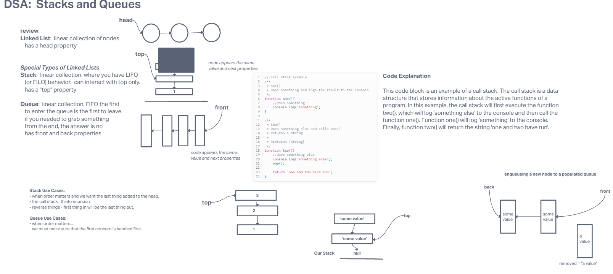

# Linked List

Build your own linked list class for future use!

## Approach & Efficiency

- We approached the new functions by visualizing and stepping through them before writing the code. Then after we finished out whiteboard tested the code in an ide and putting both eyes on it to fix any errors we could have made.

## Whiteboard process

- 
- [psuedo-queue](./pseudo-queue/README.md)
- [animal-shelter queues](./animal-shelter/README.md)

### What is a Stack/Queue

Stacks are a data structure consisting of nodes. It's basically a linked list with a specific use case... To order things FILO or LIFO. First in Last Out, or Last in First Out. Unlike a line at the store which is First in FIRST OUT, stacks are the opposite. In terms of linked lists, the HEAD becomes TOP, and the names of functions in reference to a Stack is different, however much of the base functionality is greatly the same! Queues are like a line at the store. First in first out. Or Last in last out. Very similar even when the terminology is mixed up a bit.

### Tests

- Can successfully push onto a stack
  Can successfully push multiple values onto a stack
  Can successfully pop off the stack
  Can successfully empty a stack after multiple pops
  Can successfully peek the next item on the stack
  Can successfully instantiate an empty stack
  Calling pop or peek on empty stack raises exception

- Can successfully enqueue into a queue
  Can successfully enqueue multiple values into a queue
  Can successfully dequeue out of a queue the expected value
  Can successfully peek into a queue, seeing the expected value
  Can successfully empty a queue after multiple dequeues
  Can successfully instantiate an empty queue
  Calling dequeue or peek on empty queue raises exception

## Solution

- run `npm test stack-and-queue` to confirm all tests for Both stacks and queues
- To run and test the code simply instantiate a new linked list `const queue/stack = new Queue/Stack()`
