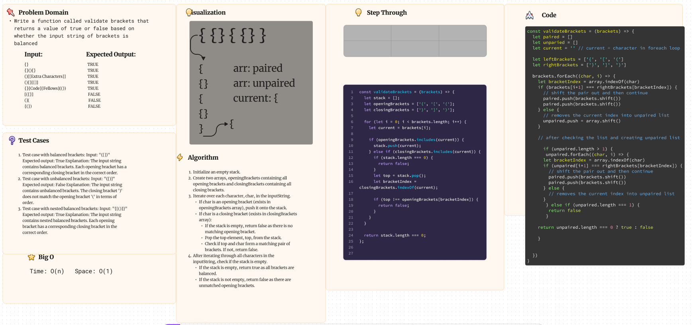

# Multi-bracket Validation

Write a function called validate brackets that takes in a string and returns true or false when brackets are balanced.

## Whiteboard Process

## Approach & Efficiency

## Solution

To run the code simply type `npm test brackets`
