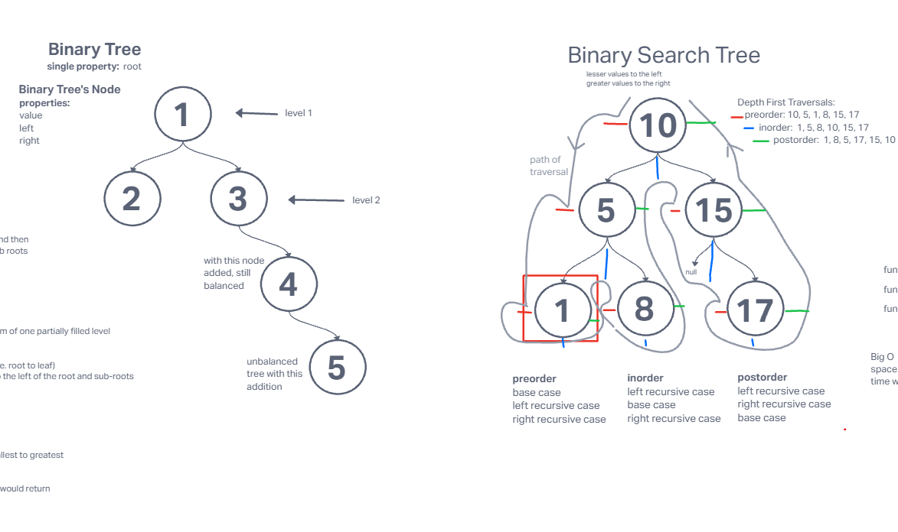
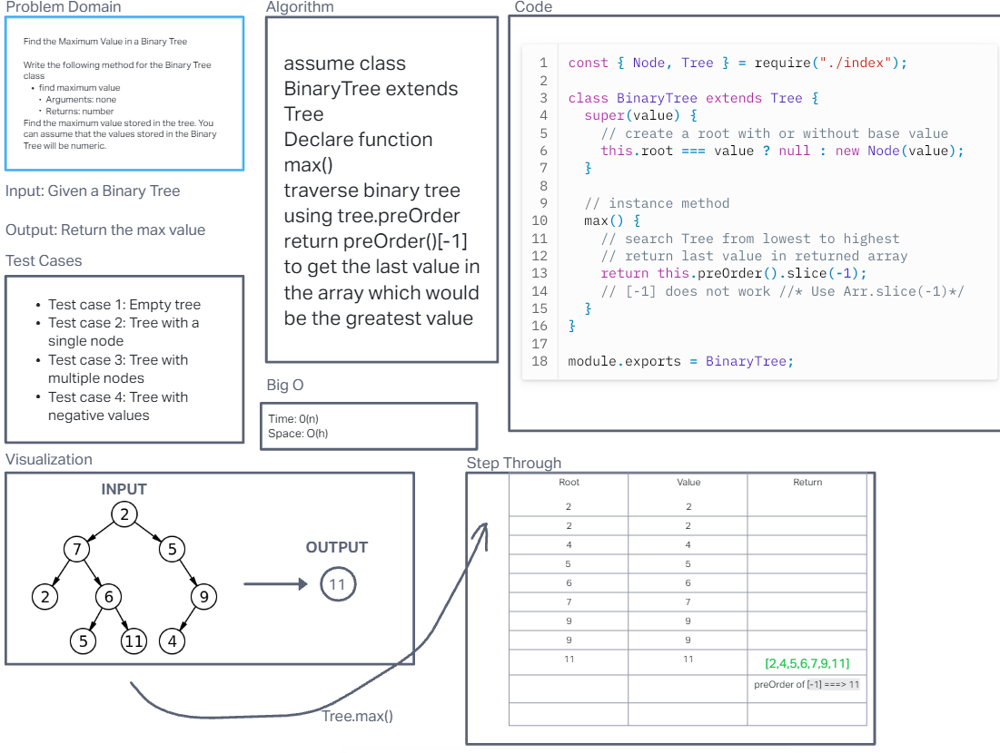
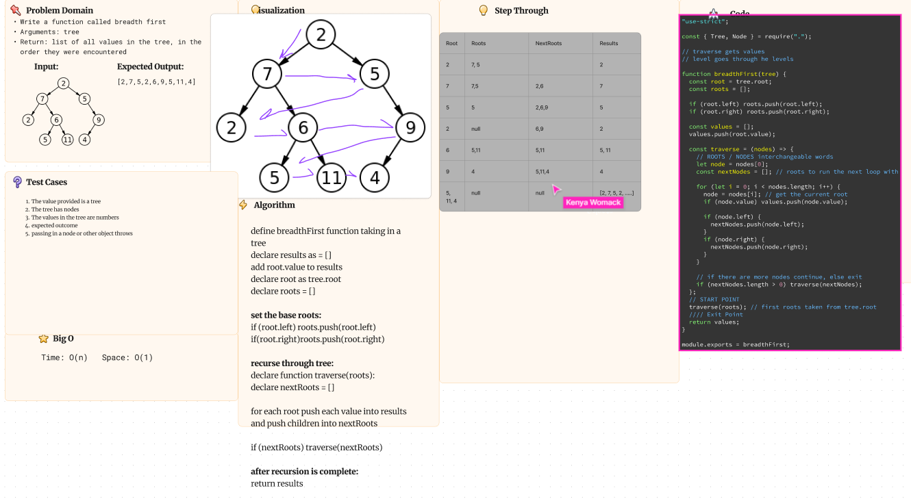
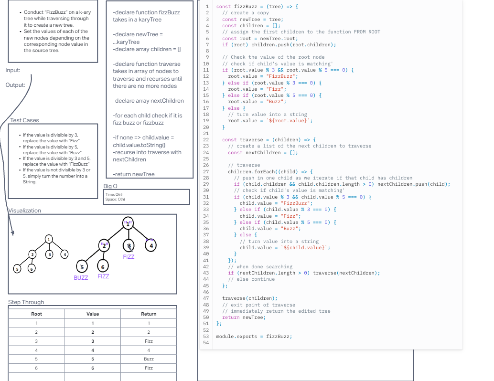

# Trees

## Build your own tree class for future use!

## Approach & Efficiency

- We approached the new functions by visualizing and stepping through them before writing the code. Then after we finished out whiteboard tested the code in an ide and putting both eyes on it to fix any errors we could have made.

## Whiteboard process

- 
- 
- 
- 

### What is a Tree?

Trees are a highly organized data structure composed of many parts. Trees have many nodes that create branches which stem from a root. Each branch has a node with k amount of nodes connected to it with their own nodes. The nodes are separated into right and left which allows you to traverse the 'edges' of the trees until you find the bottom 'leaf' which is a node that has no children. Probably the bottom of the branch, or at least that edge. Following the edges of the tree all the way down and counting the amount of nodes gives the height. A Tree keeps track of a lot of values and provides two main forms of locating values in it. Breadth and Depth searches. They are very useful for storing data that is efficient and effectively stored

### Tests

- Can successfully instantiate an empty tree
  Can successfully instantiate a tree with a single root node
  For a Binary Search Tree, can successfully add a left child and right child properly to a node
  Can successfully return a collection from a pre-order traversal
  Can successfully return a collection from an in-order traversal
  Can successfully return a collection from a post-order traversal
  Returns true false for the contains method, given an existing or non-existing node value

## Solution

- run `npm test trees` to confirm all tests for Both stacks and queues
- To run and test the code simply instantiate a new linked list `const tree/bst = new Tree/BinarySearchTree()`you can instantiate it with or without a starting value
